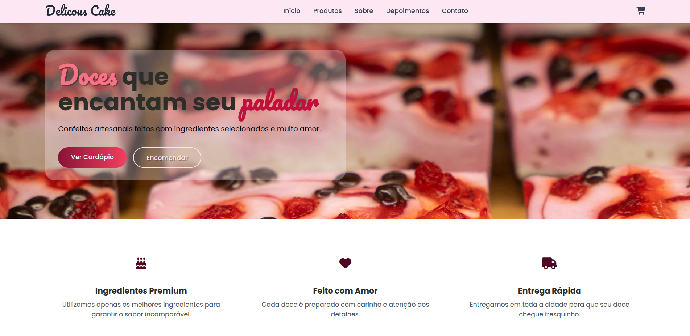

<h2> O que é um projeto?</h1>

🎂 🧁 Delicous Cake - Landing Page de Confeitaria (Projeto Fictício)
Com o objetivo de apresentar minhas habilidades em desenvolvimento front-end. Apesar de ser um produto fictício, a página foi criada como se fosse a apresentação real de uma confeitaria coma proposta de captacao de clientes, com foco em design moderno, responsividade e boas práticas de HTML e CSS.

Apesar de ser um produto fictício, a página foi criada como se fosse a apresentação real de uma confeitaria, com a proposta de **atrair clientes**, simulando a experiência de um projeto real.

Este projeto reforça minha capacidade de:

- Criar **interfaces organizadas** e **funcionais**;
- Aplicar conceitos de **design responsivo**;
- Utilizar **HTML semântico** e **CSS bem estruturado**.

## Tecnologias utilizadas

## 📸 Preview

